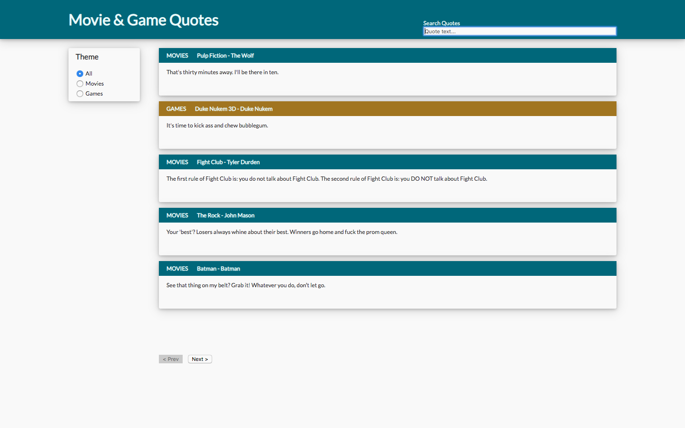
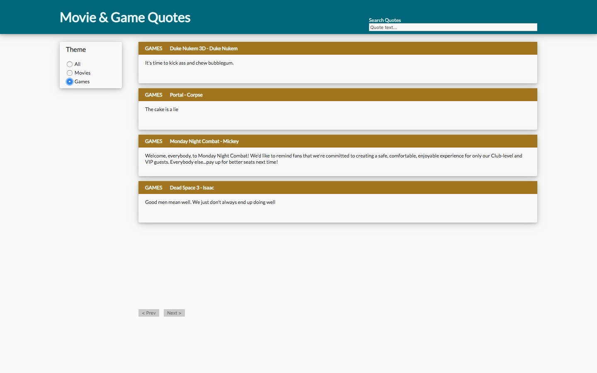

# quotes - vue.js project
[View Demo video for quote app: https://vimeo.com/329216467](https://vimeo.com/329216467)

## challenge and tech
Challenged to use vue.js create the front end for an app that displays movie and game quotes based on call to given source, a gist with json of quotes. Given repo with bare bones html, css, and src directory of vue.js source code. Component app.js scaffolded and referenced in html as entrypoint. Opted to do some additional styling (pulled color scheme from challenge givers website) and use vue animated transitions. 

## component hierarchy
* app.js
  * navbar.js
  * theme-filter.js
  * paginated-view.js
    * quote.js

